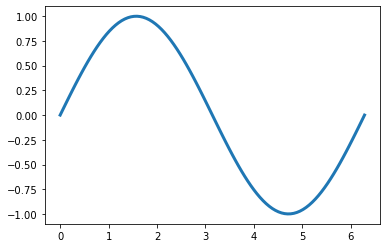
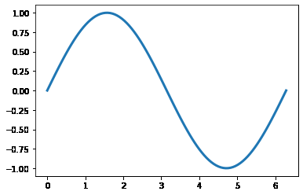

# savingFiles-py
Saving files in Python 

This repository holds functions that I use to save figures when doing analysis. These functions are meant to help organize figures and make the saving process easier. 

The `Using_SaveFiles.ipynb` is a tutorial notebook. (All the examples below come from this notebook). 

## best_save

This function is the work horse of the group. It takes in a figure object and filename and then either finds the appropriate folder or creates the approriate folder. For more details on the logic of where to save, please look into the function or send me an email. 

Here is an example figure that was saved:

## writeGif

This function is useful for making .gif files. I find that people understand .gif files much better than large subplots of time series data. And it works great to show behavioral information. 

The methods I use for this is to save a bunch of figures (frames) and then put them together. Therefore, I create a loop to save the frames and then call this function outside of the loop to compile these together. 

Here is an example gif that was saved: 

